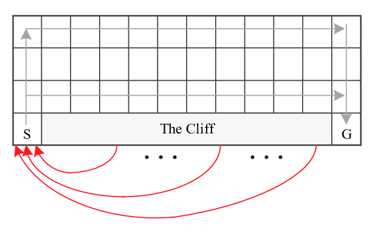

# Reinforcement Learning (November 29th)


### **You are expected to modify agents.py**

## A) Environment

  This assignement will be an implementation of Value Iteration, Policy Iteration, Q-Learning

We used the Cliff Walking Environment (also from Sutton's book).

    Adapted from Example 6.6 (page 132) from Reinforcement Learning: An Introduction
    by Sutton and Barto:
    The board is a 4x12 matrix, with (using Numpy matrix indexing):
        [3, 0] as the start at bottom-left
        [3, 11] as the goal at bottom-right
        [3, 1..10] as the cliff at bottom-center
    Each time step incurs -1 reward, and stepping into the cliff incurs -100 reward
    and a reset to the start. An episode terminates when the agent reaches the goal or falls into the cliff.




## B) How can I interact with my environment ?
The environment class (`self.mdp.env`) is a subclass of OpenAI Gym environment (docs: https://gym.openai.com/docs/#environments).

You may require to use the following method in your implementation.
* Get observation space: `self.mdp.env.observation_space`
* Get action space: `self.mdp.env.action_space`
* Nb states: `self.mdp.env.nS`
* Nb actions: `self.mdp.env.nA`
* List of final states: `self.mdp.final_states`
* Reward received at a particular state: `self.mdp.get_reward`
* Transition function: `self.mdp.env.P`


## C) How do I complete these files ?

You are provided with the `main.py` file, a MDP test bed and a runner. Use `python main.py -h`
to check how you are supposed to use this file. You will quickly notice that all
subcommands return error messages (except for random agent):

```bash
python main.py RD # Random agent
python main.py VI # Value iteration
python main.py PI # for policy iteration
python main.py QL # Q-learning agent
```

Fill in the `# TO IMPLEMENT` part of the code of `agents.py` by completing blank methods for each Agent.


## D) How do I proceed to be evaluated ?

Send `agents.py` to heri(at)lri(dot)fr before November, 29th 2021 at 23:59.
You will be noted on the implementation of the 3 agents (VI, PI, Q-learning) in the `agents.py` file.
Bonus points will be given to clean, scalable code.
