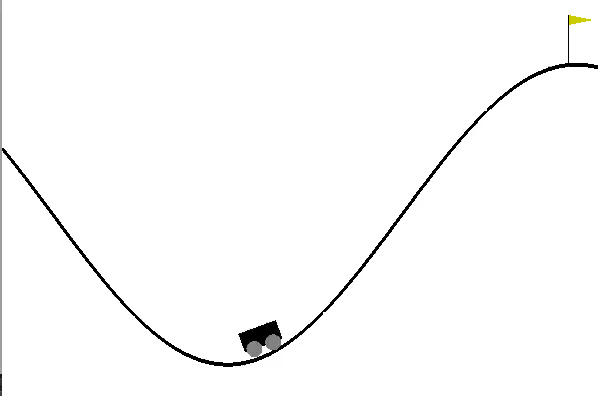

# Practical session #4

Install:
```bash
pip install scikit-learn
pip install pyglet
pip install cma
```


## Linear function approximation

In this project, you are asked to solve the classic Mountain Car (https://gym.openai.com/envs/MountainCar-v0/). Unlike previous environment, states are continuous so that you need to approximation. For more details about action and observation space, please refer to the OpenAI documentation here: https://github.com/openai/gym/wiki/MountainCar-v0



You will implement:
* Linear approximation of state Value (V(s)) with V(s, \theta) = <s, theta>
  * Monte-Carlo State Value Approximation
  * TD(0) State Value Approximation
  * TD(\lambda) State Value Approximation
* Linear approximation of state-action Value (Q(s, a)) with Q(s, a, \theta) = <(s, a), theta> or Q(s, a, \theta_a) = <s, \theta_a>
  * TD(0) State-Action Value Approximation
* Linear approximation of the policy (\PI(s)) with \PI(s, \theta) = <s, theta>
  * Direct Policy Search using CMA (covariance matrix adaptation)


Usage command line:

```bash
python main.py -h
usage: main.py [-h] [--agent AGENT_CLASS] [--nepisodes n] [--verbose]

Practical Session on Function Approximation

optional arguments:
  -h, --help           show this help message and exit
  --agent AGENT_CLASS  Class to use for the agent. Must be in the 'agents'
                       module. Possible choice: (MC-VL, TD0-VL, TDLambda-VL,
                       TD0-QL, DPS)
  --nepisodes n        number of episodes to simulate
  --verbose            Display cumulative results at each step
```


Interacting with the environment:

```python
>>> import numpy as np
>>> from environment import Mountain
>>> env = Mountain()
>>> state = env.observe()
>>> done = False
>>> while not done:
      action = np.random.choice([0, 1, 2])
      state, reward, done = env.step_from_state(state, action)
```

To implement:
* `act` method: output optimal action at a given state
* `update` method: update `self.theta` using (stochastic) gradient descent
* define `self.theta` in `__init__` (`TD0_Q_Learning_Function_Approximation`)
* `train` method in `Direct_Policy_Search_Agent`: find optimal policy (parameterized by \theta)


**Note:** Use `self.preprocessing` method to generate better state representation; `n_components` being a parameter.


## Grading

Send `agents.py` to heri(at)lri(dot)fr before December, 15th 2021 at 23:59.
